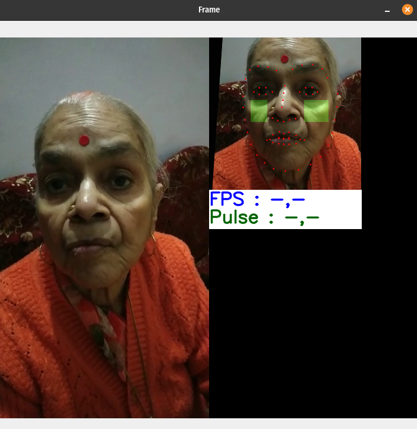
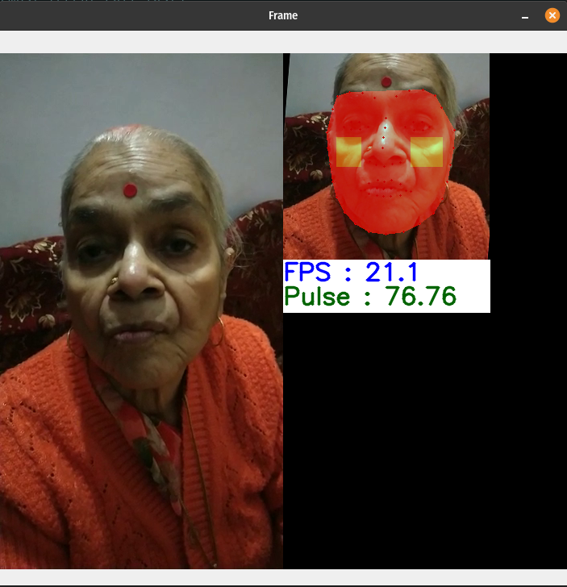

# Heart-rate-monitoring-system
[](https://github.com/rohandubey/Pulse-rate-monitoring-system/blob/master/LICENSE)


[](https://pypi.python.org/pypi/trains-jupyter-plugin/) 
<br><br>
## Introduction
This is a python code that detects the **pulse** of a an individual using a webcam or Network IP camera (http/ rtsp/ rtmp). This is a non-touch based method specifically for those people suffering from **Hypersensitivity**. Other than this, this software is extremely useful in current COVID-19 pandemic as it requires pure contactless functioning. 
This software is build using OpenCV Framework and using Fourier transformation to get the Pulese Value on a fitered and cleaned data received.
## Inference
- This software uses OpenCV to detect human face and isolates the cheeks region. 
- Cheeks region contain most of the blood vessels passing through and thus is in our ***Region of Interest(ROI)***.<br>
 <br>
- It monitors green color intensity(subimage of red colou, as red is reflected) in the ROI and isolates the pulse pattern from the average intensity.
- using a low bandpass filter and Fast Fourier Transformation.
- The exagerated color patters makes it easier for heartbeat identification.
- Then the pulse is isolated in about 5 secs and updates every 2 secs and syncs with user's heartbeat.
## Working
- execute 
```bash
$ python run.py    --camera 0  # webcam(number)
                   --source file.jpg  # image 
                            file.mp4  # video
                            rtsp://170.93.143.139/rtplive/470011e600ef003a004ee33696235daa  # rtsp stream
                            rtmp://192.168.1.105/live/test  # rtmp stream
                            http://112.50.243.8/PLTV/88888888/224/3221225900/1.m3u8  # http stream
                     --move True # If camera/user are not stable
                            False # if camera/user are stable
```
- Wait for 5 secs for software to isolate Pulse. The waiting screen looks like this:<br>
 <br>
- The isolated Pulse value is shown in the screen and gets updated every 2 secs.<br>
 <br>
## Installation
Face detection mode to be downloaded and kept in same repository, file to be downloaded : ["shape_predictor_68_face_landmarks.dat"](https://github.com/italojs/facial-landmarks-recognition/blob/master/shape_predictor_68_face_landmarks.dat)
## Authors
Made with ❤️ by Rohan Dubey
## References
- [OpenCV](https://github.com/opencv/opencv)
- [Scipy](https://github.com/scipy/scipy)
- [Dlib](https://github.com/davisking/dlib)
